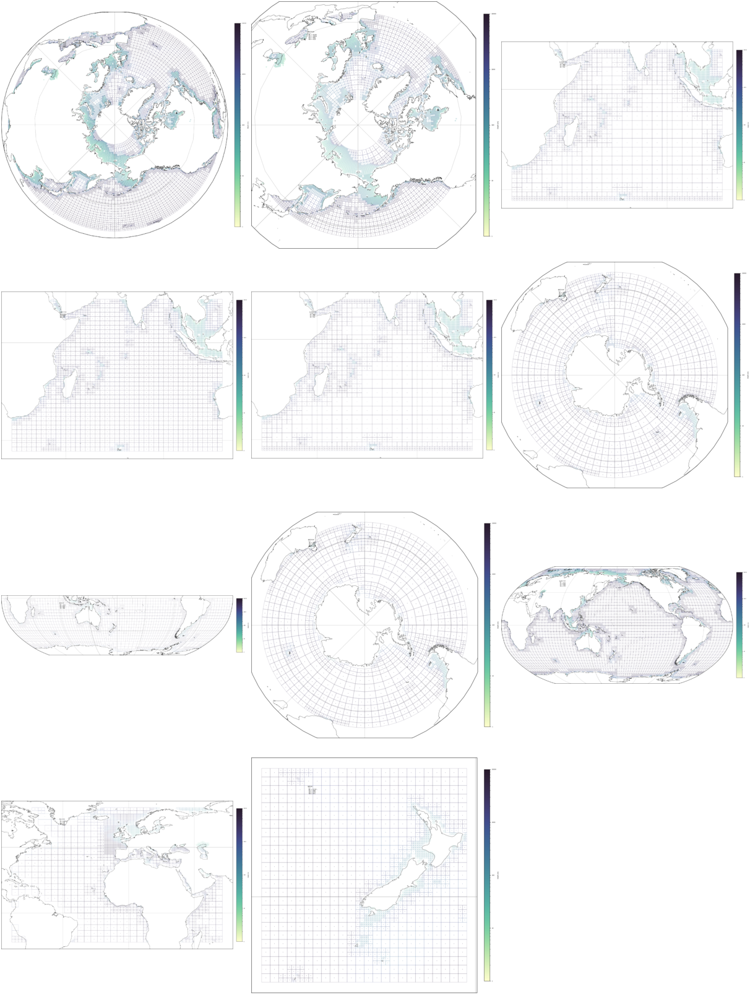

Introduction
=============

This repository contains tools to generate and work with Spherical-Multiple-Cell
(SMC) grids for WAVEWATCH III.  Code is based library is based on several bits
and pieces of code have been cobbled together into a common library and modified.
Tools provided here are very much a work in progress, and are in various stages
of completeness. 

The main python class::

    SMCPy/         - Main python class for creating SMC grids
    SMCPy/fortran/ - Fortran code for generating face arrays
    SMCPy/matlab/  - Matlab gridgen code for generating bathy
    SMCPy/bathy/   - C based alternative code for generating bathy
    examples/      - Examples of how this library is used

Other bits and pieces::
    
    smc            - Python code for generating plots from smc flat output files
    idl            - IDL scripts for producing SMC grids
    ww3_src        - Alterations to ww3 code 
    docs           - Project documentation 

Documentation presented here is a work in progres....

General Features
----------------

TODO - flesh this out

Bathymetry generation examples: `here <bathy_generation.html#Bathymetry Generation>`__ 

SMC grid generation examples: `here <examples.html#Examples>`__ 

Contributions
--------------

Source code can be found here https://gitlab.com/oceanum/pysmc

Current contributors are:

- Tom Durrant   t.durrant@oceanum.science
- Andy Saulter  andrew.saulter@metoffice.gov.uk
- JianGuo Li    jianguo.li@metoffice.gov.uk
- Chris Bunney  christopher.bunney@metoffice.gov.uk
- Qingxiang Liu qingxiang.liu@unimelb.edu.au


The code contained in the repository is available to the community. Any contributions are welcome. Please feel free to fork this project and create pull requests, or contact Tom Durrant or Andy Saulter.

